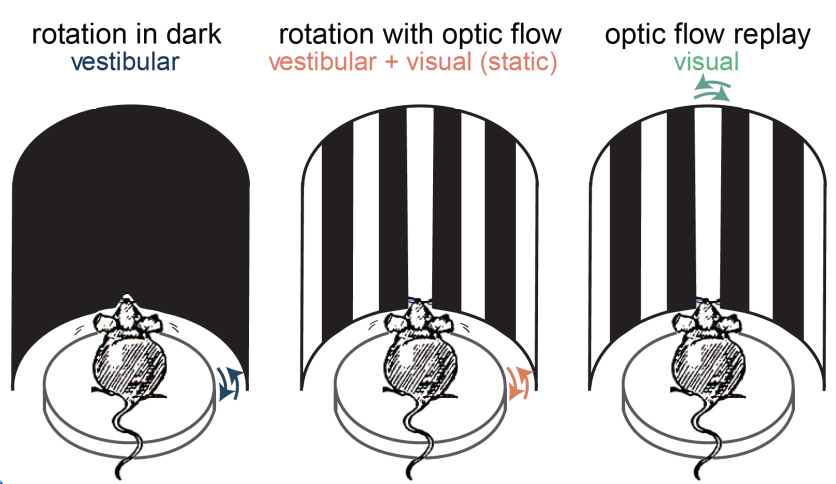
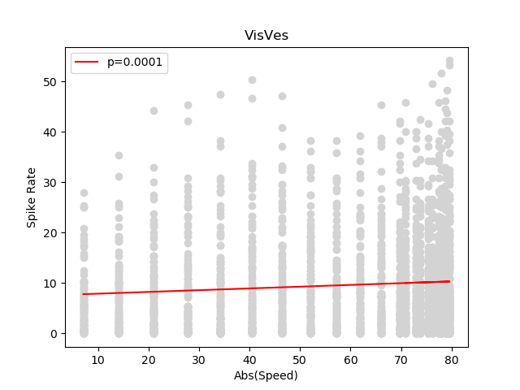

# SCGB-SURF: Initial Conversations

We will characterize electrophysiological recordings from mice in the experiment depicted in the figure below probing the integration of visual and vestibular information across the brain ([Keshavarzi et al., 2021](https://www.biorxiv.org/content/10.1101/2021.01.22.427789v4.abstract)). Click on the figure to view a movie of the experimental setup.

In the **Vestibular** condition (left figure) mice were rotated in the dark and only received vestibular stimulation. In the **Visual** condition (right panel) mice remained fixed but the walls painted with a graiting rotated, providing only visual stimulation. In the **Visual+Vestibular** condition (center panel) mice were rotated in the light, providing both visual and vestibular stimulation.

The following [csv file](data/All_three_exp_conditions_4.csv) contains information about neural recordings. Each row in this file provides information about a recorded neuron in a brief time bin during the experiment. Four columns are relevant for the following investigation:

1. **Speed**: mean rotation speed of the animal and/or visual stimuli.

2. **Spike Rate**: spike rate of a cell.

3. **Condition**: condition (visual|vestibular|visual+vestibular).

4. **Region**: brain region where the recorded cell was located.

We want to find on what conditions and brain regions there is a significant linear relation between the absolute value of the stimuli speed and the spike rate of time bins.

For example, the following figure plots the firing rate in time bins of all neurons in V1, in the Visual+Vestibular, condition as a function of the absolute value of the speed. It also shows the linear regression line and its p-value, indicating that there is a significant linear relation between spikes rate and absolute value of speed.

[]

First try to reproduce the plot above and then compute similar plots for all conditions and brain regions.

